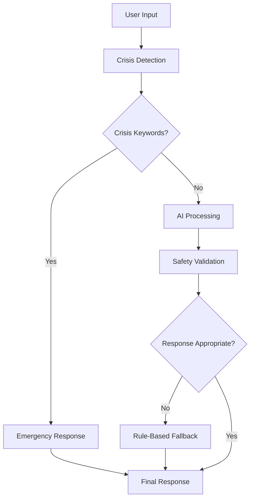

# 🤖 Google Gemini API Integration Guide

This guide explains how to integrate Google's Gemini AI into the AI Mental Health Companion for enhanced empathetic responses and emotion detection.

## 🌟 Overview

The Gemini integration adds advanced AI capabilities to the mental health companion while maintaining safety-first principles and ethical boundaries. The system supports multiple operational modes:

- **Rule-based**: Traditional keyword-based emotion detection and template responses
- **Gemini**: Pure Gemini AI for both emotion detection and response generation
- **Hybrid**: Combines Gemini intelligence with rule-based safety fallbacks (RECOMMENDED)

## 🚀 Quick Start

### 1. Automatic Setup (Recommended)

Run the setup script for guided configuration:

```bash
python setup_gemini.py
```

This script will:
- Check Python version compatibility
- Install required dependencies
- Guide you through API key configuration
- Test the Gemini connection
- Initialize the database
- Run basic functionality tests

### 2. Manual Setup

If you prefer manual setup:

#### Get Gemini API Key
1. Visit [Google AI Studio](https://makersuite.google.com/app/apikey)
2. Sign in with your Google account
3. Create a new API key
4. Copy the key securely

#### Install Dependencies
```bash
cd backend
pip install google-generativeai==0.3.2
```

#### Configure Environment
```bash
cp .env.gemini.example .env
# Edit .env with your settings
```

Essential configuration:
```env
# Core Settings
SECRET_KEY=your-32-character-secret-key
ENVIRONMENT=development
DATABASE_URL=sqlite:///./data/mental_health_companion.db

# Gemini Configuration
GEMINI_API_KEY=your-google-gemini-api-key-here
GEMINI_ENABLED=True
AI_MODEL_TYPE=hybrid

# Gemini Model Settings
GEMINI_MODEL=gemini-pro
GEMINI_TEMPERATURE=0.7
GEMINI_MAX_TOKENS=512

# Feature Flags
USE_GEMINI_FOR_RESPONSES=True
USE_GEMINI_FOR_EMOTIONS=False
GEMINI_FALLBACK_ENABLED=True
```

## 🏗️ Architecture

### AI Service Manager
The `AIServiceManager` coordinates between different AI services:

```python
from app.ai.ai_service_manager import ai_service_manager

# Process user input with intelligent service selection
result = await ai_service_manager.process_user_input(
    user_input="I'm feeling overwhelmed",
    user_context={"time_of_day": "evening"},
    preferred_service=AIServiceType.HYBRID
)
```

### Service Types

#### 1. Rule-Based (Always Available)
- Keyword-based emotion detection
- Template-based responses
- Fast and reliable
- No API costs

#### 2. Gemini AI
- Advanced natural language understanding
- Context-aware responses
- Empathetic communication
- Requires API key and internet

#### 3. Hybrid (Recommended)
- Combines Gemini intelligence with rule-based safety
- Automatic fallback on failures
- Best of both worlds
- Production-ready

### Safety Architecture



## 🔧 Configuration Options

### Basic Configuration

| Setting | Description | Default | Options |
|---------|-------------|---------|---------|
| `GEMINI_ENABLED` | Enable Gemini integration | `False` | `True`/`False` |
| `AI_MODEL_TYPE` | AI service to use | `rule_based` | `rule_based`, `gemini`, `hybrid` |
| `GEMINI_API_KEY` | Your Gemini API key | `None` | Your API key |

### Advanced Configuration

| Setting | Description | Default | Range |
|---------|-------------|---------|-------|
| `GEMINI_MODEL` | Gemini model variant | `gemini-pro` | `gemini-pro` |
| `GEMINI_TEMPERATURE` | Response creativity | `0.7` | `0.0-2.0` |
| `GEMINI_MAX_TOKENS` | Max response length | `512` | `1-2048` |
| `GEMINI_SAFETY_THRESHOLD` | Safety filter level | `BLOCK_MEDIUM_AND_ABOVE` | See Safety Settings |

### Safety Settings

| Level | Description | Use Case |
|-------|-------------|----------|
| `BLOCK_NONE` | No filtering | Testing only |
| `BLOCK_ONLY_HIGH` | Block high-risk content | Liberal setting |
| `BLOCK_MEDIUM_AND_ABOVE` | Block medium+ risk | **Recommended** |
| `BLOCK_LOW_AND_ABOVE` | Block low+ risk | Conservative |

### Feature Flags

```env
# What to use Gemini for
USE_GEMINI_FOR_RESPONSES=True      # Generate responses with Gemini
USE_GEMINI_FOR_EMOTIONS=False      # Detect emotions with Gemini
GEMINI_FALLBACK_ENABLED=True       # Fallback to rule-based on failures

# Circuit breaker settings (advanced)
CIRCUIT_BREAKER_THRESHOLD=5         # Failures before opening
CIRCUIT_BREAKER_TIMEOUT=300         # Timeout in seconds
```

## 📊 Monitoring and Health Checks

### Health Check Endpoints

```bash
# Overall API health
GET /health

# AI services health
GET /health/ai

# Detailed AI statistics
GET /health/ai/stats
```

### Example Health Response

```json
{
  "status": "healthy",
  "ai_services": {
    "overall_status": "healthy",
    "services": {
      "gemini": {
        "status": "healthy",
        "response_time_ms": 245.5,
        "availability_percentage": 99.2
      },
      "rule_based": {
        "status": "healthy",
        "response_time_ms": 12.3,
        "availability_percentage": 100.0
      }
    }
  }
}
```

### Circuit Breaker Status

The system includes circuit breakers to handle service failures gracefully:

- **Closed**: Service operating normally
- **Open**: Service has failed threshold, using fallback
- **Half-Open**: Testing if service has recovered

## 🛡️ Safety and Ethics

### Crisis Detection
The system maintains safety through multiple layers:

1. **Keyword Detection**: Rule-based crisis keyword identification
2. **Gemini Safety Filters**: Built-in Google safety systems
3. **Response Validation**: Post-processing content checks
4. **Emergency Fallbacks**: Always-available crisis resources

### Crisis Response Flow

```python
# Crisis keywords trigger immediate intervention
crisis_keywords = [
    "suicide", "kill myself", "end my life", 
    "hurt myself", "self harm", "cutting"
]

if crisis_detected:
    return emergency_response_with_resources()
```

### Ethical Guidelines

- **Never provide medical advice** or diagnosis
- **Always encourage professional help** for serious issues
- **Validate emotions** without dismissing concerns
- **Maintain clear AI boundaries** and limitations
- **Prioritize user safety** over AI sophistication

## 🔄 Usage Examples

### Basic Chat Integration

```python
from app.ai.ai_service_manager import ai_service_manager

async def process_chat(user_message: str, user_id: str):
    """Process a chat message with AI"""
    
    result = await ai_service_manager.process_user_input(
        user_input=user_message,
        user_context={
            "user_id": user_id,
            "time_of_day": "evening"
        }
    )
    
    return {
        "emotion": result.emotion_result.primary_emotion,
        "response": result.response_result.message,
        "coping_tools": result.response_result.coping_suggestions,
        "services_used": result.services_used
    }
```

### Emotion Analysis Only

```python
from app.ai.emotion_detection import emotion_service

# Analyze emotion with different methods
emotion_result = emotion_service.analyze_emotion(
    text="I'm feeling really anxious about tomorrow",
    method="hybrid"  # or "rule_based", "gemini"
)

print(f"Emotion: {emotion_result.primary_emotion}")
print(f"Confidence: {emotion_result.confidence}")
print(f"Source: {emotion_result.source}")
```

### Response Generation

```python
from app.ai.response_generator import response_generator

response = response_generator.generate_response(
    user_input="I can't handle all this stress",
    emotion_result=emotion_result,
    user_context={"previous_sessions": 3}
)

print(f"Response: {response.message}")
print(f"Type: {response.response_type}")
print(f"Source: {response.source}")
```

## 🚨 Troubleshooting

### Common Issues

#### 1. Gemini API Connection Fails
```bash
❌ Error: google.api_core.exceptions.PermissionDenied
```

**Solutions:**
- Verify your API key is correct
- Check API key permissions in Google Cloud Console
- Ensure billing is set up for your Google Cloud project
- Verify the API is enabled

#### 2. Rate Limiting
```bash
❌ Error: Quota exceeded
```

**Solutions:**
- Check your Gemini API quota limits
- Implement request throttling
- Consider upgrading your API plan
- Use hybrid mode to reduce API calls

#### 3. Fallback Not Working
```bash
❌ Error: All AI services failed
```

**Solutions:**
- Verify `GEMINI_FALLBACK_ENABLED=True`
- Check rule-based service is not disabled
- Review circuit breaker settings
- Check application logs

#### 4. Slow Response Times
```bash
⚠️ Warning: Average response time > 3 seconds
```

**Solutions:**
- Reduce `GEMINI_MAX_TOKENS` setting
- Increase `GEMINI_TEMPERATURE` for faster responses
- Check internet connection stability
- Consider caching frequently used responses

### Debug Mode

Enable debug logging for troubleshooting:

```env
LOG_LEVEL=DEBUG
DATABASE_ECHO=True
```

### Testing Configuration

Test your configuration:

```bash
# Test Gemini connection
python -c "
import asyncio
from app.ai.gemini_service import gemini_service
print(asyncio.run(gemini_service.health_check()))
"

# Test complete AI pipeline
python -c "
import asyncio
from app.ai.ai_service_manager import ai_service_manager
result = asyncio.run(ai_service_manager.process_user_input('Hello, how are you?'))
print(f'Response: {result.response_result.message}')
print(f'Services: {result.services_used}')
"
```

## 💰 Cost Management

### API Usage Optimization

1. **Use Hybrid Mode**: Reduces API calls by using rule-based for simple cases
2. **Optimize Token Limits**: Set appropriate `GEMINI_MAX_TOKENS`
3. **Cache Common Responses**: Implement response caching for frequent queries
4. **Monitor Usage**: Track API calls and costs regularly

### Cost Estimation

Approximate costs (as of 2024):
- **Input tokens**: $0.50 per 1M tokens
- **Output tokens**: $1.50 per 1M tokens
- **Average conversation**: ~100 tokens ($0.0002)
- **Daily usage (100 users)**: ~$2-5

### Usage Monitoring

```bash
# Monitor API usage
curl -X GET "http://localhost:8000/health/ai/stats"

# Check service performance
curl -X GET "http://localhost:8000/health/ai"
```

## 🔄 Deployment

### Production Configuration

```env
# Production settings
ENVIRONMENT=production
DEBUG=False
LOG_LEVEL=INFO

# Security
SECRET_KEY=your-production-secret-key-32-chars-min
ALLOWED_ORIGINS=https://your-domain.com

# Gemini Production Settings
GEMINI_ENABLED=True
AI_MODEL_TYPE=hybrid
GEMINI_TEMPERATURE=0.6
GEMINI_SAFETY_THRESHOLD=BLOCK_MEDIUM_AND_ABOVE
GEMINI_FALLBACK_ENABLED=True

# Performance
RATE_LIMIT_ENABLED=True
CACHE_TTL=300
```

### Docker Deployment

```dockerfile
# Dockerfile
FROM python:3.11-slim

WORKDIR /app
COPY backend/requirements.txt .
RUN pip install -r requirements.txt

COPY backend/ .
ENV PYTHONPATH=/app

EXPOSE 8000
CMD ["uvicorn", "app.main:app", "--host", "0.0.0.0", "--port", "8000"]
```

### Environment Variables for Containers

```bash
# Required environment variables
GEMINI_API_KEY=your-api-key
SECRET_KEY=your-secret-key
DATABASE_URL=your-database-url

# Optional but recommended
AI_MODEL_TYPE=hybrid
GEMINI_FALLBACK_ENABLED=True
RATE_LIMIT_ENABLED=True
```

## 🧪 Testing

### Unit Tests

```python
import pytest
from app.ai.gemini_service import GeminiService

@pytest.mark.asyncio
async def test_gemini_empathetic_response():
    service = GeminiService()
    
    if not service.is_available():
        pytest.skip("Gemini service not available")
    
    response = await service.generate_empathetic_response(
        user_message="I'm feeling sad today",
        detected_emotion="sad",
        emotion_intensity=0.7
    )
    
    assert "message" in response
    assert len(response["message"]) > 10
    assert response["source"] == "gemini"
```

### Integration Tests

```python
@pytest.mark.asyncio
async def test_ai_service_manager_fallback():
    from app.ai.ai_service_manager import ai_service_manager
    
    # Test with invalid API key to trigger fallback
    result = await ai_service_manager.process_user_input(
        "I'm feeling anxious"
    )
    
    assert result.emotion_result.primary_emotion in ["anxious", "neutral"]
    assert result.response_result.message
    assert len(result.services_used) > 0
```

### Load Testing

```bash
# Install load testing tools
pip install locust

# Run load tests
locust -f tests/load_test.py --host=http://localhost:8000
```

## 📈 Performance Optimization

### Response Time Optimization

1. **Async Processing**: All AI calls are asynchronous
2. **Connection Pooling**: Reuse HTTP connections
3. **Circuit Breakers**: Fast failure for unhealthy services
4. **Intelligent Fallbacks**: Quick rule-based responses when needed

### Memory Management

```python
# Configure connection pooling
GEMINI_CONNECTION_POOL_SIZE=10
GEMINI_CONNECTION_TIMEOUT=30

# Memory limits
GEMINI_MAX_CONCURRENT_REQUESTS=5
```

### Caching Strategy

```python
# Redis caching (optional)
REDIS_URL=redis://localhost:6379/0
CACHE_TTL=300

# Cache common responses
CACHE_EMOTION_RESPONSES=True
CACHE_COPING_SUGGESTIONS=True
```

## 🔐 Security Best Practices

### API Key Management
- Store API keys in environment variables, never in code
- Use different keys for development/production
- Rotate keys regularly
- Monitor API key usage for anomalies

### Request Validation
- Validate all user inputs
- Sanitize responses before sending
- Rate limit API endpoints
- Log security events

### Privacy Protection
```python
# Privacy settings
ENCRYPT_SENSITIVE_DATA=True
ANONYMOUS_USAGE_ANALYTICS=False
DATA_RETENTION_DAYS=365

# Audit logging (without sensitive data)
AUDIT_LOG_ENABLED=True
AUDIT_LOG_INCLUDE_MESSAGES=False
```

## 🤝 Contributing

### Development Setup

```bash
# Clone repository
git clone <repository-url>
cd ai-mental-health-companion

# Setup development environment
python -m venv venv
source venv/bin/activate  # or venv\Scripts\activate on Windows
pip install -r backend/requirements.txt

# Setup Gemini integration
python setup_gemini.py

# Run development server
cd backend
python -m app.main
```

### Code Style

```bash
# Format code
black backend/app/
isort backend/app/

# Type checking
mypy backend/app/

# Linting
flake8 backend/app/
```

### Testing

```bash
# Run tests
pytest backend/tests/

# Test coverage
pytest --cov=app backend/tests/

# Integration tests
pytest backend/tests/integration/
```

## 📚 Additional Resources

### Documentation Links
- [Google Gemini API Documentation](https://ai.google.dev/docs)
- [FastAPI Documentation](https://fastapi.tiangolo.com/)
- [Mental Health First Aid](https://www.mentalhealthfirstaid.org/)

### Community Resources
- [AI Ethics Guidelines](https://ai.google/principles/)
- [Mental Health API Best Practices](https://www.who.int/mental_health/policy/guidelines/en/)
- [Crisis Intervention Resources](https://suicidepreventionlifeline.org/)

### Support Contacts
- **Technical Issues**: Create GitHub issue
- **Security Concerns**: security@example.com
- **General Questions**: support@example.com

---

## 📞 Emergency Resources

**If you or someone you know is in crisis:**
- **National Suicide Prevention Lifeline**: 988
- **Crisis Text Line**: Text HOME to 741741
- **International Association for Suicide Prevention**: https://www.iasp.info/resources/Crisis_Centres/

**Remember: This AI system is a supportive tool and is NOT a replacement for professional mental health care.**

---

*Last updated: December 2024*
*Version: 1.0.0*